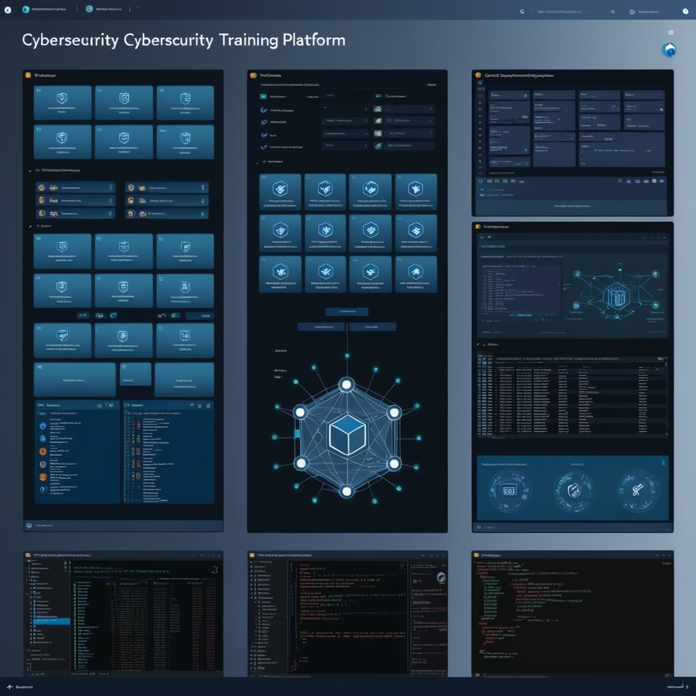

[](./LICENSE)
[](https://github.com/paralisieth/Project02/stargazers)
[](https://github.com/paralisieth/Project02/network/members)

# 🛡️ Cyber Training Platform

> A comprehensive platform for cybersecurity training, featuring isolated lab environments and virtual machine management. Perfect for educational institutions, cybersecurity professionals, and organizations conducting security training.

<p align="center">
  
</p>

## ✨ Key Features

🔒 **Secure Lab Environments**
- Isolated networking for safe exploit practice
- Pre-configured security lab templates
- Multi-VM scenario support

🖥️ **Advanced VM Management**
- Create and manage virtual machines with ease
- Real-time VM status monitoring
- Secure remote access (RDP/SSH)

👥 **User Management**
- Role-based access control
- Progress tracking
- Team collaboration features

🔐 **Enterprise-Grade Security**
- JWT-based authentication
- Network isolation
- Secure remote connections

## 🚀 Quick Start

### Prerequisites
- Python 3.7+
- VirtualBox 7.0+
- 8GB+ RAM
- 50GB+ free disk space
- Windows/Linux host OS

### One-Click Installation
```bash
# Clone the repository
git clone https://github.com/your-username/cyber-training-platform.git

# Run the setup script
./setup.sh  # Linux/Mac
# or
setup.bat   # Windows
```

For detailed setup instructions, see our [Installation Guide](./docs/deployment.md).

## 📚 Documentation

- [API Documentation](./docs/api.md)
- [Architecture Overview](./docs/architecture.md)
- [Development Guide](./docs/development.md)
- [Deployment Guide](./docs/deployment.md)
- [Security Guide](./docs/security.md)

## 🤝 Contributing

We welcome contributions! See our [Contributing Guide](./CONTRIBUTING.md) for details.

### Contributors
<a href="https://github.com/paralisieth/Project02/graphs/contributors">
  
</a>

## 📝 License

This project is licensed under the MIT License - see the [LICENSE](./LICENSE) file for details.

## 🌟 Show your support

Give a ⭐️ if this project helped you!

## 📊 Project Stats


## 🔗 Links

- [Website](https://your-project-website.com)
- [Documentation](https://your-docs-site.com)
- [Bug Reports](https://github.com/paralisieth/Project02/issues)
- [Feature Requests](https://github.com/paralisieth/Project02/issues/new)

## 🏗 Project Structure

```
backend/
├── app/
│   ├── api/
│   │   └── routes/         # API endpoints
│   ├── core/              # Core functionality
│   └── services/          # Business logic
├── tests/                 # Test cases
└── scripts/              # Utility scripts
```

## 📦 Installation

1. **Set up Python environment**
```bash
python -m venv venv
source venv/bin/activate  # On Windows: venv\Scripts\activate
pip install -r requirements.txt
```

2. **Configure environment**
```bash
cp .env.example .env
# Edit .env with your settings
```

3. **Install VirtualBox**
```bash
# Windows
./scripts/install_virtualbox.bat

# Linux
./scripts/install_virtualbox.sh
```

## 🚀 Quick Start

1. **Start the backend**
```bash
python -m uvicorn app.main:app --reload
```

2. **Create your first lab**
```bash
# Get auth token
curl -X POST http://localhost:8000/api/auth/token -d "username=admin&password=admin123"

# Create a lab
curl -X POST http://localhost:8000/api/labs -H "Authorization: Bearer YOUR_TOKEN"
```

## 🧪 Testing

```bash
pytest
pytest --cov=app tests/
```

## 🔒 Security

- Change default credentials in production
- Use HTTPS in production
- Follow security guidelines in [Security Guide](./docs/security.md)

## 🗺 Roadmap

See [ROADMAP.md](ROADMAP.md) for planned features and development timeline.
